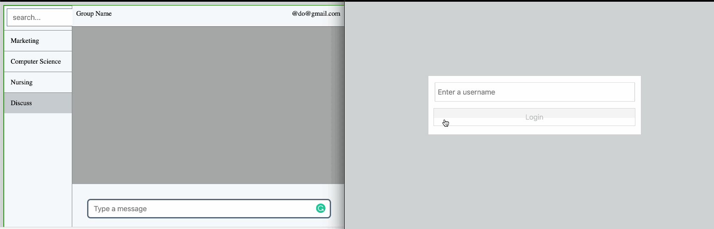

# Monitor chat rooms for prohibited language and keywords using Vue

This is a demo application showing how to monitor chat rooms for prohibited language and keywords using Vue. You can read more on how this was built [here](https://pusher.com/tutorials/welcome-action-chatroom-vue)



## Project setup

First, clone the repository:
```
git clone https://github.com/dongido001/chatkit-keyword-mod.git
```

Go to the project folder:

```
cd chatkit-keyword-mod
```

Create your env file:

```
cp .env.example .env
```
Update the keys in the file with your [Chatkit keys](https://pusher.com/chatkit)
### Client - Vue

```
npm install
npm run server
```

### Server - Node

```
cd server
node app.js
```
